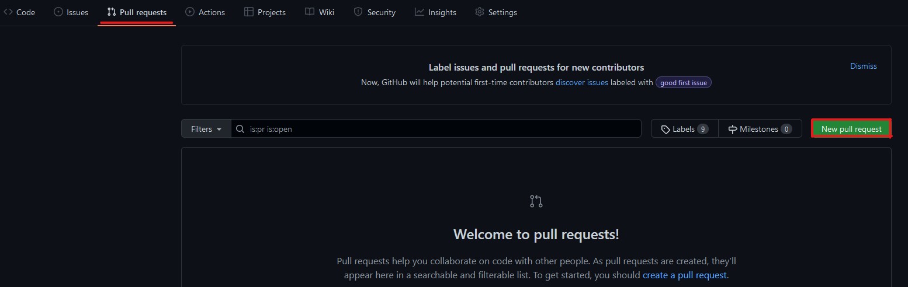

#En esta línea, primero me gustaría añadir una imagen
# Creación de un repositorio Hello World (by Adalid)
Instrucciones de la guía [Hello World](https://docs.github.com/en/get-started/quickstart/hello-world). En esta guía se muestra:
1. Cómo crear un repositorio.
2. Cómo crear una rama.
3. Cómo añadir y guardar cambios.
4.  Cómo solicitar hacer definitivos unos cambios.
5. Cómo mezclar dos ramas.
Este repositorio *hello-world* es el producto de seguir la guía. Todos los pasos realizados se documentan en este **README.md**.
## Creación del repositorio
Los repositorios son la parte fundamental del trabajo en GitHub, ya que es la forma en la que se organizan los proyectos. Para crear un repositorio, debemos:
1. Hacer click en el símbolo + en la parte superior derecha de cualquier página de GitHub.

   

2. Hacer click en `New reository`.

   

3. Añadir un **nombre**, una breve **descripción** y seleccionas `Add a README file`.
6. Hacer click en `Create repository`.

   

Con todo esto terminado, ya tenemos nuestro repositorio llamado *hello-world* con su documento **README.md**.
### Parte 2: Creación de una rama
Mientras que el repositorio es la organización del proyecto, las ramas son las diferentes versiones a las que añadimos los cambios para no perder la versión principal. Los pasos para crear una rama son:
1. En la página de tu repositorio, hacer click en el botón `main`.
2. Escribir el nombre de la rama.
3. Hacer click en `Create branch *nombre* from main`.

   

Ahora tenemos dos ramas, una rama llamada `main` y una rama llamada `readme-edits`. Los cambios que vamos a realizar los hacermos en esta segunda rama.
### Parte 3: Realizar cambios en una rama
En esta parte es donde modificaremos `readme-edits` para añadir los cambios necesarios. Para lograr ese objetivo, seguimos los siguientes pasos:
1. Hacer click en `README.md`.

   

2. Hacer click en el *símbolo del lápiz*.

   

3. Realizar los cambios que se requieren.
5. Guardar los cambios. Esto se logra poniendo **nombre** a tus cambios, seguido de una **descripción** y se acaba haciendo click en `Commit changes`.

   

Y, ¡Listo! El documento **README.md** de la rama `readme-edits` ha sido modificado.

Además, para la correcta documentación de la tarea, se ha subido en esta misma rama una serie de imágenes que servirán como guía. Para ello, debemos seguir un sistema muy parecido:
1. Hacer click en `Add file` seguido de `Upload files`.

   

2. Subir los archivos necesarios arrastrándolos en la cuadrícula.

   [Paso 2](src/images/imagen_paso2.png "¿De verdad esto hace falta?")

3. Guardar los cambios.
### Parte 4: Solicitar que un cambio se haga definitivo
Esta parte cumple un rol muy importante en los proyectos en colaboración, ya que tú y tus compañeros podéis discutir sobre los cambios realizados y si se deberían incluir definitivamente. Para abrir una solicitud, hay que:
1. Hacer click en `New pull request`, en la pestaña `Pull requests`.

   

2. Seleccionar que se compare la nueva rama con la rama `main`. Se verán los cambios que has realizado entre las dos ramas. Después se le hace click a `Create pull request`.

   

3. Añadir un **nombre**, una **descripción** y hacer click en `Create pull request`.

   

Con todo esto, ya hemos abierto la solicitud y tus colaboradores pueden revisar los cambios y hacer sugerencias.
### Parte 5: Mezclar ramas
Esta es la última parte, y la que hace definitivos los cambios realizados en las ramas alternativas. Para ello, solo hay un paso:
1. Hacer click en `Merge pull request` y después en `Confirm merge`.

   
	 
Con este último paso, ya hemos incorporado nuestros cambios en la rama principal y ya hemos terminado la guía con un repositorio *hello-world* completo.
